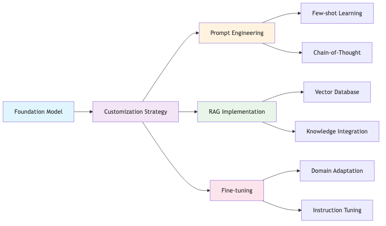

# Foundation Model Selection and Customization

## Overview

Foundation model selection and customization forms the cornerstone of successful generative AI implementations, requiring systematic evaluation across technical, business, and operational dimensions. Our methodology ensures optimal model selection and strategic customization approaches that deliver measurable business value while maintaining cost efficiency and performance standards.

This comprehensive framework addresses the complete lifecycle from initial model evaluation through production optimization, leveraging AWS managed services to minimize operational complexity while maximizing customization flexibility.

## Foundation Model Selection Framework

### Multi-Factor Selection Process

We select foundation models based on eight critical factors: output quality performance requirements, context window limitations, latency expectations, cost and customer budget constraints, customization capabilities, licensing agreements, customer skill levels, and integration complexity. This systematic evaluation ensures optimal alignment between technical capabilities and business objectives.

The selection methodology evaluates each factor against specific use case requirements, considering both technical constraints and business priorities. We assess licensing models for commercial viability, evaluate context windows for document processing requirements, measure latency against user experience expectations, and balance customization needs with organizational capabilities.

**Example**: For large document summarization, we select models based on context window capacity and processing accuracy. For a legal firm processing 100+ page contracts, we chose Claude with extended context capability, while for real-time customer service requiring sub-second responses, we selected optimized models prioritizing speed over context length. Budget-conscious implementations utilize open-source alternatives through SageMaker when organizations possess strong ML engineering capabilities.

### AWS Platform Selection Strategy

**Amazon Bedrock for Managed Services**

Amazon Bedrock provides managed access to multiple foundation models through a unified API, eliminating infrastructure complexity while ensuring enterprise security and compliance. The platform offers models from leading providers including Anthropic, AI21 Labs, Cohere, and Amazon, enabling organizations to select optimal models without managing underlying infrastructure.

**SageMaker for Custom Requirements**

SageMaker JumpStart supports organizations requiring greater customization flexibility through open-source model deployment and custom fine-tuning capabilities. The platform enables advanced optimization techniques, proprietary system integration, and specialized model configurations while maintaining AWS operational benefits and security standards.

**Amazon Q for Rapid Deployment**

Amazon Q provides pre-configured AI assistants for immediate deployment in enterprise scenarios, offering rapid value realization through prompt engineering and knowledge base integration without extensive development requirements.

**Example**: For a financial services client requiring regulatory compliance, we selected Amazon Bedrock for managed Claude access with built-in security controls. For a technology company needing specialized code generation, we implemented SageMaker with custom Llama fine-tuning. For rapid customer service deployment, we utilized Amazon Q Business with existing knowledge base integration.

## Model Customization Strategies

### Prompt Engineering Methodologies

**Few-Shot Learning Implementation**

Few-shot prompting leverages customer data to provide contextual examples that guide model behavior for specific tasks. This approach proves particularly effective for domain-specific applications where general model knowledge requires augmentation with specialized context or formatting requirements. We document all prompts used in each GenAI component and implement systematic improvement processes.

The methodology emphasizes systematic example selection based on task complexity, output format requirements, and domain specificity. We maintain version control for all prompts and implement regular performance reviews to optimize response quality and business alignment.

**Example**: For legal document analysis, we implemented few-shot prompting with domain-specific contract examples, improving clause identification accuracy from baseline to specialized performance. We documented prompts for contract review, regulatory compliance, and legal precedent analysis, with monthly A/B testing to optimize performance.

**Chain-of-Thought Reasoning**

Chain-of-thought prompting decomposes complex reasoning tasks into sequential logical steps, improving accuracy while providing transparency in decision-making processes. This methodology proves essential for applications requiring multi-step analysis, logical reasoning, or explainable AI capabilities.

We document COT prompts used in each GenAI component and maintain processes to improve and update prompts based on performance feedback. Tool integration enables access to real-time data and automated actions based on model reasoning.

**Example**: For financial risk assessment, we implement COT prompting that breaks analysis into sequential steps: data validation, ratio calculation, benchmark comparison, and risk determination. We document each tool integration including customer databases and risk assessment systems, with full audit trails for regulatory compliance.

**Agent Framework and Tool Integration**

Our agent framework supports integration with external systems through standardized interfaces, enabling comprehensive business process automation. Each tool integration includes comprehensive documentation of function, integration methods, and performance monitoring procedures.

**Example**: Customer service agents integrate with AWS Lambda for data retrieval, DynamoDB for customer lookup, and CRM systems for comprehensive context. We document each tool's function, error handling procedures, and performance metrics to ensure reliable operation.

### Retrieval Augmented Generation (RAG) Implementation

**Datastore Selection and Architecture**

RAG implementation begins with strategic datastore selection based on data characteristics, query patterns, and performance requirements. We evaluate vector databases for semantic similarity matching, enterprise search services for built-in ranking capabilities, and hybrid architectures for comprehensive information retrieval across structured and unstructured data sources.

**Example**: For technical documentation systems, we implement Amazon OpenSearch Service with vector search capabilities for semantic document retrieval. Legal knowledge bases utilize Amazon Kendra for regulatory document search with built-in compliance-focused ranking. Customer support combines vector search for FAQ matching with structured databases for customer data integration.

**Data Preparation and Ingestion**

The data preparation process encompasses document parsing, content extraction, and quality validation across diverse data types including text documents, multimedia files, and structured databases. We implement automated ingestion pipelines that handle real-time updates and maintain data freshness for accurate retrieval.

**Example**: Our RAG pipeline processes PDF technical manuals, policy documents, and database records using AWS Textract for document parsing. The ingestion pipeline handles real-time updates through streaming services, ensuring document changes are reflected in search results within acceptable timeframes.

**Chunking and Embedding Strategy**

Effective chunking strategies balance information completeness with retrieval precision through adaptive segmentation approaches. We select embedding models based on domain specificity, multilingual requirements, and computational constraints to optimize semantic similarity matching.

**Example**: Technical documentation utilizes semantic chunking based on document structure, while legal documents employ fixed-size chunking with overlap for comprehensive analysis. We implement domain-appropriate embeddings including general-purpose models for broad content and specialized embeddings for regulatory documents.

**Metadata Integration and Access Control**

Strategic metadata integration enables precise filtering and relevance ranking through business context incorporation. The metadata framework supports hierarchical filtering, temporal constraints, and access control integration to ensure appropriate information access.

**Example**: Document metadata includes classification levels, department ownership, and user permissions. Financial documents incorporate regulatory tags and compliance status. The framework enables role-based filtering while maintaining comprehensive search capabilities across authorized content.

**Re-ranking and Response Generation**

Advanced re-ranking algorithms enhance retrieval precision through multi-stage relevance scoring that combines semantic similarity with business logic. The response generation process incorporates retrieved context with source attribution for transparency and auditability.

**Example**: Our re-ranking implementation combines semantic scores with business relevance metrics, improving answer accuracy compared to basic vector search. Response generation includes source attribution enabling users to verify information sources and maintain regulatory compliance through audit trails.

### Fine-Tuning and Model Customization

**SageMaker Fine-Tuning Strategy**

SageMaker enables comprehensive model customization through domain adaptation and instruction-based fine-tuning approaches. Our methodology emphasizes systematic dataset curation, strategic hyperparameter optimization, and rigorous performance evaluation to ensure measurable improvements over baseline models. We support both open-source and proprietary model customization based on organizational requirements and technical constraints.

**Example**: For legal document analysis, we fine-tune foundation models using annotated legal document pairs, achieving significant domain accuracy improvements over baseline performance. Training utilizes parameter-efficient approaches to reduce costs while maintaining performance gains. We evaluate fine-tuned models against baseline using domain-specific test sets and customer validation scenarios.

**Amazon Bedrock Managed Customization**

Amazon Bedrock provides managed model customization through continued pre-training and fine-tuning while maintaining enterprise service benefits. Customization approaches include domain-specific vocabulary expansion, organizational style adaptation, and task-specific optimization. The managed approach eliminates infrastructure complexity while ensuring enterprise security and compliance.

**Example**: For financial services applications, we customize Bedrock models incorporating regulatory documents and compliance frameworks, achieving substantial domain accuracy improvements over baseline models. Healthcare implementations utilize managed fine-tuning with clinical documentation while maintaining HIPAA compliance requirements. Performance evaluation emphasizes domain accuracy, regulatory compliance, and system integration effectiveness.

## Downstream Task Integration and Optimization

### Strategic Task Deployment

**Content Generation and Communication**

Text generation applications balance creativity with consistency through strategic prompt engineering, parameter optimization, and output validation frameworks. Our approach supports diverse content types including marketing communications, technical documentation, and business correspondence with appropriate style and tone adaptation. Implementation emphasizes brand alignment, audience targeting, and content quality assurance to ensure consistent organizational voice and messaging effectiveness.

**Intelligent Question-Answering Systems**

Question-answering implementations combine foundation models with RAG architectures to deliver accurate, contextual responses based on organizational knowledge repositories. The approach prioritizes answer accuracy, source attribution, and confidence scoring to support informed decision-making processes while maintaining transparency and auditability in information delivery.

**Advanced Analytics and Classification**

Sentiment analysis and classification systems leverage domain-optimized models for business-specific taxonomy alignment and multi-dimensional analysis capabilities. Our methodology supports multi-class classification, aspect-based sentiment evaluation, and custom business rule integration to deliver actionable insights aligned with organizational objectives and analytical requirements.

**Technical Content and Code Generation**

Code generation and technical documentation applications utilize specialized models trained on programming languages and technical corpora. Implementation includes syntax validation, security assessment, and development workflow integration to support software development, API documentation, and technical content creation while maintaining quality and security standards.

## Performance Evaluation and Optimization

### Comprehensive Assessment Framework

**Quality and Reliability Metrics**

Performance evaluation encompasses language fluency, coherence, factual accuracy, and contextual understanding through both automated assessment and human evaluation protocols. Our framework includes domain-specific evaluation criteria, automated fact-checking integration, and confidence scoring mechanisms to ensure reliable information delivery and decision support capabilities.

**Business Impact Measurement**

Task-specific performance metrics align with business objectives and user expectations, emphasizing resolution accuracy for customer service applications, engagement metrics for content generation, and precision measures for analytical tasks. Cost-performance optimization balances operational requirements with resource utilization through strategic model selection and infrastructure optimization.

### Continuous Optimization Strategy

**Performance Monitoring and Enhancement**

Continuous monitoring frameworks track model performance across accuracy, latency, and cost dimensions with automated alerting for performance degradation. Implementation includes A/B testing capabilities for model comparison, gradual rollout strategies for updates, and systematic feedback integration to support sustained performance improvement and business value optimization.

## Conclusion

Foundation model selection and customization demands systematic evaluation across technical performance, operational requirements, and strategic business alignment. Our comprehensive methodology ensures optimal model selection and customization approaches that deliver measurable business value while maintaining operational efficiency and cost effectiveness.

Strategic utilization of AWS technologies including Amazon Bedrock, SageMaker, and supporting services enables sophisticated generative AI implementations that adapt to evolving requirements while maintaining enterprise-grade security, compliance, and performance standards. This framework supports organizations in achieving sustainable competitive advantages through intelligent foundation model deployment and optimization strategies.
