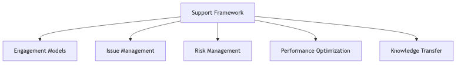

# Maintenance and Support Services for Generative AI Projects

## Overview

Post-launch maintenance and support services ensure effective use, sustained performance, and continuous improvement of deployed generative AI applications. Our framework provides structured approaches to ongoing support, risk management, and performance optimization based on customer feedback and operational insights.

Support plans are tailored to project requirements, with service levels, response procedures, and engagement models defined during project planning to align with customer operational needs and risk tolerance.

## Support Plan Structure and Engagement Models

### Engagement Duration and Phases

Support engagements can be structured across different timeframes depending on customer requirements and application complexity. Each phase addresses specific operational needs and maturity levels.

**Stabilization Period**

Initial post-launch stabilization typically spans several weeks to months, focusing on ensuring system stability, addressing early operational issues, and optimizing performance based on real-world usage patterns. This phase includes intensive monitoring, rapid issue response, and frequent optimization cycles as the system adapts to production workloads.

**Example**: For a customer service chatbot deployment, stabilization could involve daily monitoring of response quality, weekly model performance reviews, and bi-weekly optimization cycles during the first two months post-launch.

**Ongoing Production Support**

Long-term production support can be structured as monthly, quarterly, or annual engagements based on application criticality and customer preferences. Support scope encompasses routine maintenance, performance monitoring, periodic optimization, and continuous improvement initiatives.

**Example**: Production support for a document processing system could include monthly performance reviews, quarterly model retraining assessments, and annual comprehensive system optimization aligned with evolving business requirements.

**Flexible Engagement Models**

Support arrangements can be customized based on customer operational models, ranging from reactive issue resolution to proactive optimization programs. Engagement intensity adjusts to application maturity, with higher-touch support during initial periods transitioning to more autonomous operations as systems stabilize.

**Example**: Support could transition from weekly touchpoints during stabilization to monthly reviews during steady-state operations, with escalation procedures available for urgent issues regardless of standard engagement cadence.

## Contact and Escalation Procedures

### Issue Reporting Mechanisms

Customers can report operational issues through multiple channels designed for different urgency levels and issue types. Clear reporting procedures ensure appropriate routing and timely resolution.

**Primary Contact Channels**

Support ticketing systems provide structured issue documentation capturing problem descriptions, system context, and business impact. Email channels offer alternatives for less urgent matters or detailed technical discussions. Communication platforms enable real-time collaboration for time-sensitive issues requiring immediate attention.

**Example**: Customers can submit issues through a dedicated support portal for tracking and documentation, email support addresses for general inquiries, or direct communication channels for critical production incidents.

### Escalation Framework

Escalation procedures ensure critical issues receive appropriate attention and resources. The framework defines clear escalation paths based on issue severity and business impact.

**Severity-Based Escalation**

Issue classification determines escalation paths and response expectations. Critical issues affecting production operations or causing significant business impact trigger immediate escalation to senior technical resources. High-priority issues impacting system performance or user experience receive expedited attention. Medium and low-priority issues follow standard resolution workflows with regular status updates.

**Example**: A production outage affecting customer-facing services would trigger immediate escalation to technical leads and project stakeholders, while a performance optimization request would follow standard prioritization processes.

**Escalation Hierarchy**

Initial contact with technical support addresses most operational issues. Complex technical challenges escalate to specialized engineers with deep system knowledge. Business-critical situations engage project leadership ensuring appropriate resource allocation and stakeholder communication.

**Example**: Escalation paths can include initial response from support engineers, technical escalation to AI/ML specialists for model-specific issues, and executive escalation for situations requiring business decisions or resource commitments.

## Response Times and Service Level Framework

### Issue Severity Classification

Issue severity determines response priorities and resolution expectations. Classification considers system impact, business criticality, and available workarounds.

**Severity Definitions**

**Critical Severity**: Complete service unavailability or critical functionality failure with no workaround, causing significant business impact or revenue loss. These situations require immediate response and resolution focus.

**High Severity**: Major functionality impairment or significant performance degradation affecting multiple users or key business processes, with limited or no workarounds. These issues warrant priority attention and expedited resolution.

**Medium Severity**: Moderate functionality issues or performance concerns affecting limited users or non-critical processes, with reasonable workarounds available. These issues receive timely attention within normal business operations.

**Low Severity**: Minor issues, general questions, or enhancement requests with minimal business impact. These matters are addressed through standard support workflows.

**Example**: A chatbot completely failing to respond would be critical severity, while slow response times affecting user experience would be high severity, occasional incorrect responses with human fallback available would be medium severity, and requests for additional features would be low severity.

### Service Level Targets

Response time expectations vary based on issue severity and engagement model. Specific SLAs are defined during contract negotiation based on customer requirements, application criticality, and support tier selection.

**Response Time Framework**

Critical issues typically receive initial response within hours, with continuous work toward resolution. High-priority issues receive same-business-day response with resolution focus based on complexity. Medium-priority issues receive response within business days with resolution timelines based on impact assessment. Low-priority issues are addressed during regular support cycles.

**Example**: For a mission-critical application, critical issues could target initial response within one hour with 24/7 availability, high-priority issues within four business hours, medium-priority within one business day, and low-priority within three business days. Specific commitments are established per engagement.

**Resolution Expectations**

Resolution timelines depend on issue complexity, system architecture, and required changes. Some issues can be resolved quickly through configuration adjustments or known solutions, while others may require code changes, model retraining, or infrastructure modifications requiring longer timeframes.

**Example**: Configuration issues might resolve within hours, while model performance problems requiring retraining could take days or weeks depending on data availability and validation requirements.

## Risk Management and Continuous Monitoring

### Workload Risk Assessment

Ongoing risk management identifies potential issues before they impact production operations. Regular assessments evaluate technical risks, operational dependencies, and business continuity considerations.

**Proactive Monitoring**

Continuous monitoring tracks system health, performance metrics, and usage patterns. Automated alerting identifies anomalies, performance degradation, or unusual behavior triggering proactive investigation before customer impact occurs.

**Example**: Monitoring systems can track model prediction quality, API response times, error rates, and resource utilization, with automated alerts for metrics exceeding thresholds or showing concerning trends.

**Periodic Risk Reviews**

Regular risk assessments evaluate system resilience, dependency health, and emerging threats. Reviews consider changes in usage patterns, data characteristics, or business requirements that might introduce new risks.

**Example**: Monthly operational reviews can assess recent incidents, performance trends, capacity adequacy, and upcoming changes that might affect system stability or performance.

### Change Management

Structured change management processes minimize risks associated with system updates, model retraining, or infrastructure modifications. Changes undergo appropriate testing, validation, and staged rollout procedures.

**Example**: Model updates can follow development, staging, and production progression with validation gates ensuring new versions meet quality standards before full deployment, with rollback procedures ready if issues emerge.

## Performance Optimization and Continuous Improvement

### Feedback Integration

Customer feedback drives continuous improvement initiatives. Systematic feedback collection, analysis, and implementation ensure systems evolve to meet changing needs and improve user satisfaction.

**Feedback Collection Mechanisms**

User satisfaction surveys, issue reports, feature requests, and usage analytics provide insights into system performance and user experience. Regular customer engagement sessions discuss system effectiveness and improvement priorities.

**Example**: Quarterly business reviews can examine system performance metrics, user feedback summaries, recent enhancements, and planned improvements aligned with evolving business objectives.

**Improvement Prioritization**

Feedback analysis identifies high-impact improvements, common pain points, and optimization opportunities. Prioritization balances user impact, implementation complexity, and strategic alignment with business goals.

**Example**: Improvement backlog might prioritize response accuracy enhancements affecting user satisfaction over minor UI adjustments, while considering implementation effort and business value for each initiative.

### Model Performance Enhancement

Ongoing model optimization ensures sustained performance as usage patterns evolve and new data becomes available. Enhancement activities include retraining with updated data, prompt optimization, and architecture refinements.

**Performance Monitoring**

Continuous tracking of model accuracy, response quality, and user satisfaction metrics identifies performance degradation or optimization opportunities. Comparison against baseline metrics reveals trends requiring attention.

**Example**: Monthly performance reports can track prediction accuracy, user satisfaction scores, error rates, and response times, highlighting areas showing improvement or degradation compared to previous periods.

**Iterative Optimization**

Performance improvements follow systematic approaches including prompt refinement based on usage patterns, model retraining incorporating recent data, and architecture optimization addressing identified bottlenecks.

**Example**: Performance optimization cycles can include A/B testing of prompt variations, retraining models quarterly with accumulated production data, and infrastructure adjustments responding to usage growth.

## Knowledge Transfer and Documentation

### Operational Documentation

Comprehensive documentation enables effective system operation and knowledge continuity. Documentation includes system architecture, operational procedures, troubleshooting guides, and performance baselines.

**System Documentation**

Architecture documentation describes system components, data flows, and integration points. Operational runbooks provide procedures for common tasks including monitoring, backups, and routine maintenance. Troubleshooting guides address known issues and resolution procedures.

**Example**: Documentation can include architecture diagrams showing component relationships, runbooks for model retraining procedures, and troubleshooting guides for common error scenarios with resolution steps.

### Knowledge Sharing

Regular knowledge transfer activities ensure customer teams gain operational proficiency and system understanding. Training sessions, documentation reviews, and hands-on workshops build internal capabilities.

**Example**: Knowledge transfer can include onboarding sessions for new team members, quarterly training on system capabilities and best practices, and documentation updates reflecting system changes and lessons learned.

## Maintenance Activities and System Health

### Routine Maintenance

Scheduled maintenance activities ensure system health and prevent issues. Activities include dependency updates, security patches, performance optimization, and infrastructure maintenance.

**Maintenance Windows**

Planned maintenance occurs during agreed-upon windows minimizing business impact. Critical updates may require system downtime communicated in advance with appropriate approval and coordination.

**Example**: Monthly maintenance windows can address routine updates and optimizations, with emergency patches applied outside regular windows when security or stability require immediate action.

### System Health Monitoring

Proactive health monitoring tracks system performance, resource utilization, and operational metrics. Regular health checks identify potential issues before they affect users.

**Example**: Daily health checks can verify system availability, weekly capacity reviews assess resource adequacy, and monthly performance analyses identify optimization opportunities or capacity planning needs.

## Support Service Evolution

### Adaptive Support Models

Support services evolve as systems mature and customer teams gain operational proficiency. Initial high-touch support can transition to more autonomous operations with targeted assistance for complex issues or strategic initiatives.

**Example**: Support intensity might decrease as customer teams gain experience and systems stabilize, with engagement shifting from reactive issue resolution to proactive strategic planning and optimization initiatives.

### Continuous Service Improvement

Regular retrospectives assess support effectiveness and identify improvement opportunities. Service adjustments respond to changing customer needs, system evolution, and operational insights.

**Example**: Quarterly service reviews can evaluate response effectiveness, customer satisfaction, recurring issue patterns, and service improvements implemented based on operational learnings and evolving requirements.

## Conclusion

Effective maintenance and support services ensure generative AI applications deliver sustained value through proactive monitoring, responsive issue resolution, and continuous improvement. Our framework provides flexible engagement models tailored to customer requirements, with clear procedures for issue reporting, escalation, and resolution.

Support plans are customized during project planning, with service levels, response commitments, and engagement intensity aligned to application criticality and customer operational models. This approach ensures appropriate support coverage while maintaining flexibility to adapt as systems mature and requirements evolve.

