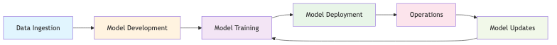

# Privacy, Security, and Compliance for Generative AI

## Overview

Establishing comprehensive privacy, security, and compliance frameworks is fundamental to successful generative AI adoption. This document outlines our strategic approach to safeguarding customer data and ensuring regulatory compliance throughout the generative AI lifecycle, leveraging AWS security services and industry best practices to build customer trust and enable secure AI innovation.

## Confidentiality, Integrity, and Availability Framework

### Data Protection Strategy

Our data protection strategy implements a defense-in-depth approach that secures customer data across all phases of the generative AI lifecycle. The framework establishes multiple security layers, from data ingestion through model deployment and ongoing operations, ensuring comprehensive protection against evolving threats.

**Encryption and Access Control**

Data protection begins with comprehensive encryption strategies that secure information both at rest and in transit. All customer data is encrypted using AES-256 encryption managed through AWS Key Management Service (KMS), providing enterprise-grade protection with centralized key management and audit capabilities. Data in transit utilizes Transport Layer Security (TLS) 1.3 to ensure secure communication between all system components.

Access control implementation follows the principle of least privilege through AWS Identity and Access Management (IAM) with fine-grained policies that restrict data access to authorized personnel and systems only. Role-based access control (RBAC) ensures that users can access only the data necessary for their specific functions, while multi-factor authentication (MFA) provides additional security layers for sensitive operations.

**Example**: For a healthcare client implementing AI-powered diagnostic assistance, patient data is encrypted at rest using AWS KMS with customer-managed keys, transmitted via TLS 1.3, and accessed only by authorized medical professionals through role-based permissions that align with HIPAA requirements and clinical workflows.

**Network Security and Isolation**

Network security implementation leverages AWS PrivateLink to establish private connectivity to Amazon Bedrock and other AI services, ensuring that data never traverses the public internet. Virtual Private Cloud (VPC) configurations create isolated network environments with custom security groups and network access control lists (NACLs) that restrict traffic to authorized sources and destinations.

AWS WAF (Web Application Firewall) provides application-layer protection against common web exploits and bot attacks, while AWS Shield offers DDoS protection for all applications. Network segmentation isolates AI workloads from other systems, reducing attack surfaces and containing potential security incidents.

**Example**: A financial services client processes sensitive transaction data through a dedicated VPC with PrivateLink endpoints for Bedrock access, ensuring that AI model interactions remain within the AWS backbone network while maintaining compliance with PCI-DSS requirements.

### Data Governance and Classification

**Data Classification Framework**

Our data classification system categorizes information based on sensitivity levels and regulatory requirements, enabling appropriate security controls and handling procedures. The framework defines four classification levels: Public, Internal, Confidential, and Restricted, each with specific protection requirements and access controls.

Classification automation uses AWS Macie to discover and classify sensitive data automatically, identifying personally identifiable information (PII), protected health information (PHI), and financial data within datasets. This automated approach ensures consistent classification across large data volumes while reducing manual effort and human error.

**Data Anonymization and Pseudonymization**

Data anonymization procedures implement multiple techniques to protect individual privacy while preserving data utility for AI training and inference. Techniques include data masking, tokenization, differential privacy, and k-anonymity methods that remove or obscure identifying information while maintaining statistical properties necessary for model performance.

Pseudonymization strategies replace identifying information with artificial identifiers, enabling data linkage for analysis while protecting individual privacy. These techniques are particularly valuable for longitudinal studies and personalization use cases where data relationships must be preserved.

**Example**: A retail client implements differential privacy techniques to analyze customer purchasing patterns for recommendation systems, adding statistical noise that prevents individual identification while preserving aggregate trends necessary for accurate AI recommendations.

## Compliance and Regulatory Adherence

### Regulatory Compliance Strategy

**Multi-Jurisdiction Compliance**

Our compliance framework addresses multiple regulatory environments simultaneously, ensuring that generative AI implementations meet requirements across different jurisdictions and industries. The framework covers GDPR for European operations, CCPA for California-based activities, HIPAA for healthcare applications, SOX for financial reporting, and industry-specific regulations such as PCI-DSS for payment processing.

Compliance implementation leverages AWS Audit Manager with the generative AI best practices framework, providing automated evidence collection and continuous compliance monitoring. This approach reduces manual audit preparation while ensuring comprehensive documentation of security controls and compliance measures.

**Data Residency and Sovereignty**

Data residency requirements are addressed through strategic AWS region selection and data localization policies that ensure customer data remains within specified geographic boundaries. Cross-border data transfer mechanisms comply with adequacy decisions, standard contractual clauses, and binding corporate rules as appropriate for each jurisdiction.

**Example**: A European healthcare provider processes patient data exclusively within EU AWS regions, implements GDPR-compliant consent mechanisms, and maintains detailed data processing records through automated logging and audit trails that demonstrate compliance with data protection regulations.

**Privacy-Preserving Mechanisms**

Privacy-preserving technologies enable AI model training and inference while protecting individual privacy rights. Techniques include federated learning for distributed model training without centralized data collection, homomorphic encryption for computation on encrypted data, and secure multi-party computation for collaborative analysis without data sharing.

These advanced privacy techniques enable organizations to leverage AI capabilities while meeting stringent privacy requirements and maintaining customer trust through demonstrable privacy protection.

### Risk Assessment and Management

**Comprehensive Risk Assessment Framework**

Our risk assessment methodology evaluates threats across multiple dimensions including data security, model security, operational security, and compliance risks. The assessment process identifies potential vulnerabilities, evaluates likelihood and impact, and prioritizes mitigation efforts based on risk severity and business impact.

Threat modeling utilizes the AWS Generative AI Security Scoping Matrix to categorize use cases and apply appropriate security controls based on application scope and risk profile. This structured approach ensures that security measures are proportionate to risk levels while maintaining operational efficiency.

**Continuous Risk Monitoring**

Risk monitoring implementation provides real-time visibility into security posture through AWS CloudWatch metrics, AWS CloudTrail logging, and AWS Config compliance monitoring. Automated alerting systems notify security teams of potential incidents, policy violations, or configuration changes that may impact security posture.

Regular security assessments include penetration testing, vulnerability scanning, and security architecture reviews that identify emerging threats and validate control effectiveness. These assessments inform continuous improvement efforts and ensure that security measures evolve with changing threat landscapes.

**Example**: A financial technology company implements continuous risk monitoring that tracks API usage patterns, detects anomalous access attempts, and automatically triggers incident response procedures when suspicious activities are identified, ensuring rapid threat detection and response.

## Generative AI Security Practices

### Model Security and Integrity

**Secure Model Development**

Model security begins during development with secure coding practices, dependency management, and supply chain security measures that prevent malicious code injection and ensure model integrity. Model versioning and provenance tracking provide complete audit trails of model development, training data sources, and modification history.

Model validation processes include adversarial testing, bias detection using Amazon SageMaker Clarify, and performance evaluation across diverse datasets to ensure robust and fair model behavior. These validation procedures identify potential vulnerabilities and biases before production deployment.

**Runtime Security Controls**

Runtime security implementation includes input validation and sanitization to prevent prompt injection attacks, output filtering to detect and prevent sensitive information disclosure, and rate limiting to prevent abuse and ensure service availability. Amazon Bedrock Guardrails provide content filtering capabilities that block inappropriate inputs and outputs based on configurable policies.

Model monitoring tracks performance metrics, detects drift and anomalies, and identifies potential security incidents through behavioral analysis. Automated response systems can isolate compromised models, trigger incident response procedures, and maintain service continuity through failover mechanisms.

**Example**: A customer service AI system implements multi-layered security controls including input sanitization to prevent prompt injection, output filtering to protect customer PII, and behavioral monitoring that detects unusual query patterns and automatically escalates potential security incidents.

### Application Security Integration

**Secure API Design**

API security implementation follows OAuth 2.0 and OpenID Connect standards for authentication and authorization, ensuring that only authorized applications and users can access AI services. API rate limiting and throttling prevent abuse while maintaining service availability for legitimate users.

API monitoring tracks usage patterns, identifies potential security threats, and provides detailed audit logs for compliance and incident investigation. AWS API Gateway provides comprehensive API management capabilities including request/response transformation, caching, and security policy enforcement.

**Integration Security**

Integration security ensures that generative AI capabilities integrate securely with existing enterprise systems through encrypted connections, mutual authentication, and comprehensive logging. Service mesh architectures provide additional security layers including traffic encryption, access control, and observability for microservices-based AI applications.

**Example**: An enterprise document processing system integrates AI capabilities through secure APIs with OAuth 2.0 authentication, encrypted data transmission, and comprehensive audit logging that tracks all AI interactions for compliance and security monitoring purposes.

## Continuous Monitoring and Incident Response

### Security Operations Integration

**Monitoring and Response Framework**

Our security operations leverage AWS native monitoring capabilities to provide comprehensive oversight of AI system security posture and structured incident response. Automated threat detection systems analyze CloudWatch logs, metrics, and behavioral patterns to identify potential security incidents and trigger appropriate response procedures based on project-specific requirements.

Incident response procedures include predefined playbooks for common AI security scenarios, escalation procedures tailored to each client engagement, and communication protocols that ensure stakeholders are informed appropriately. On-call support arrangements are evaluated and implemented on a project-by-project basis, depending on client requirements and service level agreements.

**Compliance Monitoring and Reporting**

Compliance monitoring provides continuous assessment of regulatory adherence through automated policy checking, configuration monitoring, and audit trail analysis. Compliance dashboards provide real-time visibility into compliance status and highlight areas requiring attention.

Regular compliance reporting generates comprehensive documentation for auditors and regulators, demonstrating ongoing adherence to applicable requirements and providing evidence of effective control implementation.

**Example**: A healthcare AI platform implements automated HIPAA compliance monitoring through AWS Config rules, CloudTrail audit logging, and scheduled compliance assessments. The client's internal compliance team receives detailed reports and dashboards, with our team providing technical support and remediation guidance as needed based on the agreed service level.

## Conclusion

This comprehensive privacy, security, and compliance framework provides the foundation for secure generative AI implementation on AWS. By combining robust technical controls with comprehensive governance frameworks and continuous monitoring capabilities, organizations can leverage generative AI capabilities while maintaining the highest standards of data protection and regulatory compliance.

The framework's emphasis on defense-in-depth security, automated compliance monitoring, and continuous risk assessment ensures that security measures evolve with changing threat landscapes and regulatory requirements, providing sustainable protection for customer data and AI applications throughout their operational lifecycle.
