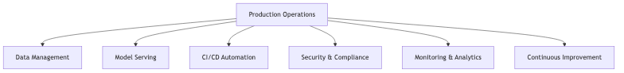
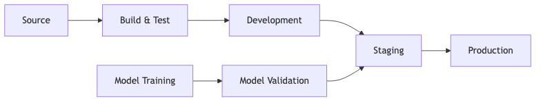

# Generative AI Project Production Launch and Operations

## Overview

Production operationalization of generative AI projects requires comprehensive approaches spanning application components, infrastructure, and operational processes. Our methodology addresses the complete production lifecycle including deployment automation, security and compliance integration, continuous monitoring, and iterative optimization across all system components.

This framework provides systematic approaches to operationalizing generative AI solutions on AWS, ensuring reliability, security, and sustained performance in production environments.

## Data Management and Freshness

### Data Store Maintenance Strategy

Data freshness directly impacts generative AI system accuracy and relevance. Our approach implements systematic processes for maintaining current, high-quality information across all data stores supporting RAG implementations, fine-tuning workflows, and production inference.

**Refresh Frequency Determination**

Data refresh cadence depends on information volatility and business requirements. High-velocity data including real-time inventory, market prices, or news feeds requires continuous or near-real-time updates. Medium-velocity data such as product catalogs, policy documents, or customer records typically requires daily or weekly refresh cycles. Low-velocity data including historical archives, regulatory references, or foundational knowledge bases can operate on monthly or quarterly refresh schedules.

**Example**: For a financial services knowledge base, we would implement hourly updates for market data and regulatory alerts, daily refreshes for internal policy documents, and weekly updates for general financial education content.

### Data Preparation and Ingestion

**Automated Data Pipelines**

AWS services provide comprehensive capabilities for automated data ingestion and processing. Amazon S3 serves as the primary data lake for raw content storage with versioning enabled for change tracking and rollback capabilities. AWS Glue implements ETL workflows for data transformation, cleansing, and validation before ingestion into production data stores. Amazon EventBridge orchestrates scheduled refresh operations and responds to data source change events.

Data preparation includes format standardization, quality validation, deduplication, and metadata enrichment. AWS Lambda functions implement custom transformation logic for specialized data types or business rules. Amazon Textract extracts structured information from documents, while Amazon Comprehend performs content analysis and classification.

**Example**: Document processing pipelines can utilize S3 event notifications triggering Lambda functions for Textract extraction, followed by Glue jobs for validation and enrichment, with processed data indexed in OpenSearch Service or stored in knowledge base formats.

### Backup and Recovery

**Data Protection Strategy**

S3 versioning maintains complete change history enabling point-in-time recovery. S3 replication provides geographic redundancy for disaster recovery scenarios. Automated backup policies capture data store snapshots at regular intervals with retention periods aligned to business requirements and compliance obligations.

Recovery procedures include data integrity validation, incremental update mechanisms, and rollback capabilities for problematic data batches. Testing recovery processes regularly ensures operational readiness for incident scenarios.

**Example**: Vector databases can implement daily snapshots with 30-day retention, cross-region replication for critical knowledge bases, and automated validation testing monthly to ensure recovery procedures remain functional.

## Foundation Model Customization and Serving

### Training Infrastructure and Throughput

**Platform Selection**

Amazon SageMaker provides managed training infrastructure with flexible compute options. Training job selection depends on model size, dataset volume, and timeline requirements. GPU instances accelerate large model training while CPU instances suffice for smaller models or inference optimization. SageMaker supports distributed training across multiple instances for large-scale fine-tuning operations.

Amazon Bedrock offers managed model customization without infrastructure management. Custom model hosting through SageMaker endpoints provides control over instance types, autoscaling policies, and deployment configurations. Provisioned throughput ensures consistent performance for production workloads with predictable latency requirements.

**Example**: For foundation model fine-tuning, we would utilize SageMaker training jobs with GPU instances for the training phase, then deploy optimized models to SageMaker endpoints with autoscaling based on request volume patterns.

### Model Versioning and Management

**Version Control Strategy**

SageMaker Model Registry maintains comprehensive model lineage including training data references, hyperparameters, evaluation metrics, and deployment history. Each model version receives unique identifiers enabling precise tracking and rollback capabilities. Model metadata captures training timestamps, data characteristics, and performance benchmarks.

Model approval workflows implement validation gates before production deployment. A/B testing capabilities enable gradual rollout of new model versions with performance comparison against baseline models. Rollback procedures ensure rapid reversion to previous versions when issues emerge.

**Example**: Model versioning can track iterations through development, staging, and production environments. Each version would include training metrics, validation results, and approval status, enabling teams to compare performance across versions and maintain deployment history.

## CI/CD Automation and Deployment

### Automated Deployment Pipelines

**Pipeline Architecture**

AWS CodePipeline orchestrates end-to-end deployment workflows from code commit through production release. Source stage monitors repositories for application code, infrastructure definitions, and model artifacts. Build stage executes testing, validation, and artifact creation. Deployment stages progress through development, staging, and production environments with automated validation gates.

AWS CodeBuild can execute unit tests, integration tests, and security scans. AWS CodeDeploy can manage application deployment with blue-green or canary deployment strategies minimizing risk. AWS CloudFormation or CDK can implement infrastructure as code ensuring consistent environment provisioning.

**Example**: CI/CD pipelines can integrate SageMaker Pipeline for model training workflows, triggering automated retraining when new data becomes available, validating model performance against thresholds, and deploying approved models to production endpoints automatically.

### Component Integration

**Full-Stack Deployment**

Frontend applications can deploy through Amazon CloudFront for global content delivery with S3 origins for static assets. Backend APIs can deploy to AWS Lambda for serverless architectures or ECS/EKS for containerized applications. API Gateway provides unified API management with request validation, throttling, and monitoring.

Foundation model integration can occur through Amazon Bedrock APIs for managed models or SageMaker endpoints for custom models. Vector databases can deploy to Amazon OpenSearch Service or purpose-built vector databases. Application configuration management can utilize AWS Systems Manager Parameter Store or AWS Secrets Manager for secure credential storage.

**Example**: Full-stack applications can deploy frontend to CloudFront/S3, backend APIs to Lambda functions, with Bedrock integration for model inference, OpenSearch for vector search, and RDS for application data, all orchestrated through CDK infrastructure definitions.

## Security and Compliance Integration

### Data Privacy and Protection

**Security Controls**

Data encryption at rest utilizes AWS KMS with customer-managed keys providing fine-grained access control. Encryption in transit enforces TLS 1.3 for all network communication. VPC isolation can segregate AI workloads from other systems with security groups and NACLs restricting network access when required.

For enhanced security requirements, AWS PrivateLink can provide private connectivity to Bedrock and other AWS services without internet exposure. IAM policies implement least-privilege access with role-based permissions for service-to-service communication. CloudTrail can maintain comprehensive audit logs of all API calls and data access.

**Example**: Production deployments can implement dedicated VPCs with PrivateLink endpoints for Bedrock access, KMS encryption for all data stores, IAM roles with specific permissions for each service component, and CloudTrail logging with S3 archival for compliance auditing.

### Compliance Automation

**Continuous Compliance Monitoring**

AWS Config tracks resource configuration changes and evaluates compliance against organizational policies. Config Rules implement automated compliance checks for security baselines, encryption requirements, and network configurations. AWS Security Hub aggregates security findings from multiple sources providing centralized visibility.

AWS Audit Manager facilitates compliance reporting with automated evidence collection for frameworks including SOC 2, PCI-DSS, HIPAA, and GDPR. Custom frameworks address organization-specific compliance requirements with automated control assessments.

**Example**: Compliance automation can implement Config Rules validating that all S3 buckets have encryption enabled, SageMaker endpoints use VPC configurations, and IAM roles follow least-privilege principles, with Security Hub providing unified dashboards and automated remediation workflows.

## Continuous Monitoring and Analytics

### Performance Monitoring

**Metrics and Observability**

Amazon CloudWatch can collect metrics from system components including API response times, model inference latency, error rates, and resource utilization. Custom metrics can track business-specific indicators such as user satisfaction, task completion rates, and content quality scores.

CloudWatch Dashboards provide real-time visibility into system health with customizable visualizations. CloudWatch Alarms can trigger notifications when metrics exceed thresholds enabling proactive incident response. CloudWatch Insights analyzes log data identifying patterns and anomalies.

**Example**: Monitoring dashboards can display API Gateway request volumes and latencies, SageMaker endpoint invocation metrics and errors, OpenSearch query performance, Lambda function durations, and custom metrics tracking AI response quality and user engagement.

### Model Performance Evaluation

**Production Model Monitoring**

SageMaker Model Monitor continuously evaluates model predictions detecting data drift, prediction drift, and model quality degradation. Statistical baselines established during model training provide comparison standards for production data. Automated alerts notify teams when drift exceeds acceptable thresholds.

A/B testing frameworks compare model versions measuring business impact and user experience. Shadow deployments enable validation of new models against production traffic without user exposure. Gradual rollout strategies minimize risk during model updates.

**Example**: Model monitoring can track prediction distributions comparing production inference patterns against training data distributions, measuring response time percentiles, detecting bias drift across demographic groups, and triggering retraining workflows when quality metrics fall below thresholds.

## Troubleshooting and Human Intervention

### Incident Response Framework

**Operational Procedures**

Automated alerting systems detect anomalies and performance degradation triggering incident response workflows. Runbooks document diagnostic procedures and remediation steps for common scenarios. On-call procedures ensure appropriate expertise availability for production issues.

Human review queues capture edge cases, low-confidence predictions, and user-reported issues requiring expert evaluation. Feedback loops integrate human corrections into model improvement cycles. Escalation procedures route complex issues to specialized teams.

**Example**: Troubleshooting workflows can implement automated detection of elevated error rates triggering CloudWatch alarms, runbook execution for common issues like endpoint capacity saturation, human review queues for responses flagged by content filters, and escalation paths to data science teams for model quality issues.

### Diagnostic Tools

**Operational Visibility**

CloudWatch Logs Insights enables rapid log analysis and pattern matching. X-Ray provides distributed tracing showing request flows across services identifying bottlenecks. VPC Flow Logs capture network traffic patterns for connectivity troubleshooting.

SageMaker Debugger analyzes training jobs identifying optimization opportunities and convergence issues. CloudWatch Contributor Insights identifies top contributors to metrics like API errors or high latency enabling targeted investigation.

**Example**: Diagnostic procedures can utilize Logs Insights to search error logs across Lambda functions and API Gateway, X-Ray traces to identify slow service dependencies, and CloudWatch metrics to correlate user-reported issues with system performance anomalies.

## Performance Optimization

### Inference Optimization

**Latency and Throughput**

Model optimization techniques include quantization reducing model size and inference time, compilation optimizing model execution for specific hardware, and caching frequently requested predictions. SageMaker Neo compiles models for edge and cloud deployment with optimized performance.

Endpoint configurations balance latency and cost through instance type selection and autoscaling policies. Multi-model endpoints reduce infrastructure costs by hosting multiple models on shared resources. Asynchronous inference handles long-running batch predictions efficiently.

**Example**: Performance optimization can implement model quantization reducing inference time by 40%, response caching for common queries reducing latency from seconds to milliseconds, and autoscaling policies adding capacity during peak hours while minimizing costs during low-traffic periods.

### Cost Optimization

**Resource Efficiency**

Compute optimization includes spot instances for training workloads reducing costs significantly, reserved instances or savings plans for predictable production workloads, and rightsizing instance types based on actual utilization patterns. Storage optimization implements lifecycle policies archiving infrequent data to lower-cost tiers.

Bedrock pricing models include on-demand inference and provisioned throughput options. Cost monitoring tracks spending across services with budget alerts and anomaly detection. Resource tagging enables cost allocation across projects and business units.

**Example**: Cost optimization strategies can utilize spot instances for overnight training jobs, provision throughput for high-traffic production endpoints with predictable usage, implement S3 lifecycle policies moving older documents to Glacier, and establish budget alerts triggering review when spending exceeds forecasts.

## Model Retraining and Continuous Improvement

### Automated Retraining Pipelines

**Retraining Strategy**

SageMaker Pipelines orchestrate end-to-end model training workflows including data preparation, training execution, evaluation, and conditional deployment. Retraining triggers include scheduled intervals, data drift detection, performance degradation alerts, and new data availability thresholds.

Training data management maintains version control over training datasets enabling reproducible model training. Incremental training approaches update existing models with new data reducing computational requirements compared to full retraining. Validation frameworks ensure new model versions outperform existing production models before deployment.

**Example**: Automated retraining can implement monthly full retraining cycles for baseline model updates, weekly incremental training incorporating recent data, and event-driven retraining when model performance metrics fall below thresholds, with automated validation ensuring improvements before production deployment.

### Prompt Engineering Management

**Prompt Versioning and Optimization**

Prompt templates maintain consistency across application components with version control tracking prompt evolution. A/B testing evaluates prompt variations measuring task completion rates, response quality, and user satisfaction. Prompt libraries enable reuse across similar use cases.

Prompt optimization iterates based on production feedback and model performance. Variables in prompts enable customization while maintaining structure. Documentation captures prompt engineering decisions, tested variations, and performance results.

**Example**: Prompt management can maintain a library of validated prompts for common tasks with version control in Git, implement A/B testing comparing prompt variations for customer service responses measuring resolution rates, and document prompt engineering guidelines based on production learnings.

### Continuous Feedback Integration

**Improvement Cycles**

User feedback collection mechanisms capture satisfaction ratings, error reports, and improvement suggestions. Stakeholder feedback engages domain experts evaluating output quality and relevance. Automated quality metrics track response accuracy, coherence, and business value.

Feedback analysis identifies systematic issues, emerging use cases, and optimization opportunities. Prioritization frameworks balance quick wins with strategic improvements. Iterative deployment implements enhancements incrementally with measurement validating positive impact.

**Example**: Feedback loops can collect user ratings after each interaction, implement monthly review sessions with domain experts evaluating response quality samples, analyze feedback trends identifying common issues, and prioritize improvements based on user impact and implementation feasibility.

## Orchestration and Automation

### Workflow Orchestration

**End-to-End Automation**

AWS Step Functions orchestrate complex workflows coordinating multiple services and handling error scenarios gracefully. Workflows can include data ingestion, transformation, model training, evaluation, deployment, and monitoring with conditional logic and retry mechanisms.

EventBridge schedules recurring operations and responds to system events triggering appropriate workflows. Lambda functions implement custom orchestration logic and service integrations. SageMaker Pipelines provide ML-specific orchestration for training and deployment workflows.

**Example**: Orchestration workflows can implement complete data refresh cycles triggered weekly, coordinating S3 data arrival, Glue ETL processing, OpenSearch index updates, model retraining when data volume thresholds are met, automated testing, and production deployment with approval gates.

## Conclusion

Production operationalization of generative AI projects requires comprehensive integration across application components, infrastructure, and operational processes. Our framework addresses deployment automation, security and compliance, continuous monitoring, performance optimization, and iterative improvement through systematic approaches leveraging AWS managed services.

This methodology ensures reliable, secure, and performant generative AI systems in production environments while maintaining operational efficiency through automation and providing clear procedures for troubleshooting and continuous enhancement.

