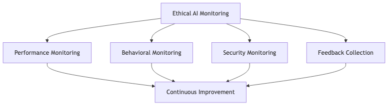

# Responsible and Ethical Generative AI Best Practices

## Overview

Responsible generative AI implementation prioritizes accuracy, safety, transparency, user empowerment, and sustainability while addressing potential risks and biases. Our framework ensures AI systems deliver business value while maintaining ethical standards and regulatory compliance throughout the development and operational lifecycle.

## AI Ethics Policies

### Core Ethics Principles

Our AI ethics policy establishes fundamental principles guiding all generative AI initiatives. Human welfare and dignity remain paramount, with AI systems enhancing rather than replacing human decision-making. Fairness and non-discrimination principles ensure equitable treatment across all demographic groups. Transparency requirements mandate clear documentation of system behavior, limitations, and decision-making processes. Privacy protections safeguard personal information with appropriate technical and organizational controls. Accountability mechanisms establish clear ownership for AI system behavior and outcomes.

**Example**: For financial services credit assessment, we would document ethics policies requiring human review of all lending decisions, record model behavior with feature importance analysis, implement fairness metrics tracking across demographics, and maintain escalation procedures for disputed decisions.

### Governance and Oversight

We establish governance frameworks appropriate to project scope and risk level. High-risk applications receive enhanced oversight through cross-functional review teams comprising technical, legal, and business stakeholders. Standard oversight procedures include pre-deployment assessments, production monitoring, and periodic performance reviews aligned with business objectives and regulatory requirements.

**Example**: Healthcare diagnostic systems would undergo medical professional review, legal compliance assessment, and patient safety evaluation before deployment, with ongoing monitoring of performance across patient demographics and clinical conditions.

## Accuracy and Quality Assurance

### Human Oversight Integration

Human validation ensures AI output accuracy and appropriateness. We implement oversight proportionate to use case risk, with high-stakes applications requiring comprehensive human review and lower-risk applications utilizing sampling-based validation. Confidence thresholds trigger automatic escalation when AI certainty falls below acceptable levels.

**Example**: Legal document systems can route AI suggestions through attorney review, with low-confidence outputs flagged for senior lawyer evaluation. Calibration sessions can assess suggestion quality and identify improvement opportunities.

### Validation and Fact-Checking

Automated validation provides quality assurance for AI-generated content. Source verification cross-references outputs against authoritative data, consistency checking identifies contradictions, and temporal validation ensures information currency. AWS CloudWatch tracks accuracy metrics, alerting teams when performance degrades below thresholds.

**Example**: Medical information systems can cross-reference AI-generated summaries against peer-reviewed literature, flag claims lacking evidence, and require physician verification for older information or low-confidence outputs.

## Bias Detection and Mitigation

### Bias Assessment Process

Bias detection occurs throughout the AI lifecycle. Pre-training analysis examines datasets for demographic representation and potential historical bias. Amazon SageMaker Clarify measures fairness metrics including statistical parity and conditional acceptance rates across protected attributes. Production monitoring detects emerging biases as data distributions evolve.

**Example**: For recruitment screening systems, we would measure advancement rates across gender, age, and ethnicity. If SageMaker Clarify identified lower advancement for candidates from certain universities, we would rebalance training data and implement demographic parity constraints with ongoing fairness monitoring.

### Mitigation Strategies

Multi-stage interventions address bias across the AI lifecycle. Data-level approaches include resampling underrepresented groups and reweighting training examples. Algorithm-level techniques incorporate fairness constraints into model training. Post-processing adjustments ensure outputs satisfy fairness criteria while maintaining accuracy and business value.

**Example**: Loan approval systems can implement balanced training data, fairness-constrained optimization requiring equal opportunity across protected groups, and post-processing calibration ensuring equitable approval rates with comprehensive audit logging.

### AWS Bias Detection Tools

SageMaker Clarify provides integrated bias detection and explainability. Pre-training analysis identifies fairness issues before model development. Post-training evaluation assesses models across multiple fairness metrics. Feature attribution explains individual predictions. SageMaker Model Monitor provides continuous production monitoring, detecting bias drift as distributions change.

**Example**: Healthcare diagnostic systems can utilize SageMaker Clarify to analyze accuracy across patient demographics. If analysis reveals lower accuracy for elderly patients with comorbidities, we would augment training data and establish continuous monitoring tracking diagnostic performance across all patient populations.

## Transparency and Explainability

### Model Interpretability

Global interpretability explains overall model behavior by identifying influential features and documenting limitations. Local interpretability explains individual predictions with feature contributions and confidence scores. This transparency enables stakeholders to assess model alignment with business logic and ethical principles.

**Example**: Fraud detection systems can provide global interpretability showing transaction amount, merchant category, and location as primary risk factors. Flagged transactions can receive local explanations with specific triggering factors and confidence scores.

### Documentation Practices

Model cards provide standardized documentation including intended use cases, training data characteristics, performance metrics across demographics, and ethical considerations. Deployment documentation details system integration, oversight mechanisms, monitoring approaches, and update procedures. User-facing disclosures clearly communicate AI involvement and provide mechanisms for human review.

**Example**: Customer service chatbot documentation can include model cards with training data sources, performance metrics across query types, and known failure modes. Customer interfaces can indicate AI involvement and enable human agent transfer requests.

### AWS Transparency Tools

SageMaker provides explainability through SHAP values quantifying feature contributions and feature importance analysis. CloudWatch dashboards offer real-time performance visibility. CloudTrail maintains comprehensive audit logs of model interactions, training events, and configuration changes, ensuring complete traceability.

**Example**: Financial advisory systems can leverage SageMaker explainability to show how risk tolerance, timeline, and market conditions influence recommendations. CloudWatch enables advisors to monitor recommendation distributions, while CloudTrail maintains audit trails for compliance.

## User Empowerment and Informed Consent

### Consent Management

Consent mechanisms provide clear explanations of data collection purposes, AI system usage, retention policies, and user rights. Granular controls enable users to provide or withdraw consent for specific purposes. Users maintain visibility into consent decisions and can modify preferences at any time.

**Example**: Personalization systems can implement layered consent with initial service access consent followed by specific requests for optional features. Users can access consent dashboards showing active permissions and withdraw consent with clear explanations of functionality impact.

### User Control

Users receive meaningful control over AI interactions. Preference management enables behavior customization and automation level adjustment. Override mechanisms allow users to reject AI recommendations and request human review. Data access features enable users to view, download, correct, or delete personal information.

**Example**: Health monitoring applications can provide adjustable alert sensitivity, options to disable automated alerts, ability to exclude specific metrics from analysis, and one-click data export in standard formats with complete deletion options.

## Safety Measures and Risk Management

### Content Safety Controls

Amazon Bedrock Guardrails provide configurable content filtering blocking harmful outputs including hate speech, violence, and self-harm content. Topic-based filtering prevents generation on prohibited subjects. Toxicity detection identifies harmful language. PII detection and redaction prevents inadvertent disclosure of sensitive information.

**Example**: Educational content platforms can implement Bedrock Guardrails blocking violent or sexual content, filtering PII, restricting controversial topics, and implementing age-appropriate language filtering with comprehensive logging for policy refinement.

### Risk Assessment

Risk identification evaluates technical risks including model errors and system failures, ethical risks such as bias and privacy violations, operational risks like AI dependency, and regulatory compliance risks. Mitigation strategies implement layered controls proportionate to identified risks with monitoring systems for early detection and incident response procedures for rapid remediation.

**Example**: Medical diagnosis systems can implement mandatory physician review, automated alerts when recommendations conflict with clinical guidelines, fallback procedures for system unavailability, and comprehensive error logging with periodic risk assessments.

## Sustainability and Environmental Responsibility

### Computational Efficiency

Model optimization selects efficient architectures, implements compression techniques including quantization and pruning, and leverages transfer learning. Infrastructure optimization utilizes AWS managed services, selects appropriate instance types, implements autoscaling, and leverages AWS renewable energy initiatives.

**Example**: Recommendation systems can reduce environmental impact through distilled models requiring less computational resources, AWS Graviton instances providing better energy efficiency, autoscaling approaches, and training job scheduling during high renewable energy availability periods.

### Sustainable Development

Efficient experimentation minimizes unnecessary training runs through systematic model selection and automated hyperparameter optimization. Lifecycle management implements model retirement procedures and regularly evaluates whether deployed models justify computational costs. Continuous monitoring tracks resource utilization and identifies optimization opportunities.

**Example**: Document processing platforms can share embedding models across applications, automate hyperparameter optimization, conduct performance reviews consolidating underutilized systems, and track carbon footprint through AWS Customer Carbon Footprint Tool.

## Continuous Monitoring and Improvement

### Monitoring Framework

Performance monitoring tracks accuracy across demographics, fairness indicators, user satisfaction, and model drift. Behavioral monitoring analyzes user interactions identifying confusion or inappropriate usage. Security monitoring tracks access patterns, detects potential breaches, and monitors for adversarial attacks.

**Example**: Financial trading systems can track prediction accuracy across asset classes, measure transaction success rates, monitor trading volumes and risk exposures, and analyze trader interactions with CloudWatch dashboards providing real-time visibility and automated anomaly alerts.

### Feedback Integration

User feedback mechanisms enable error reporting, satisfaction ratings, improvement suggestions, and bias escalation. Stakeholder feedback engages domain experts, compliance teams, and affected communities. Automated analysis identifies common issues through natural language processing and trend analysis. Improvement prioritization evaluates feedback based on severity, feasibility, and ethical alignment.

**Example**: Customer service AI can collect satisfaction ratings, error reports, and conduct focus groups with service representatives and customer advocacy groups. Analysis identifying knowledge gaps can lead to expanded training data with improvements verified through A/B testing before full deployment.

## Compliance and Regulatory Adherence

### Regulatory Framework

Compliance requires monitoring emerging AI regulations, assessing applicability, and evaluating compliance gaps. Documentation maintains records of system development, deployment decisions, performance monitoring, and incident responses. Regulatory engagement includes industry participation and proactive regulator communication.

**Example**: For EU operations, we would maintain AI Act compliance including risk classification, high-risk system documentation, conformity assessments, and ongoing monitoring. Healthcare applications would ensure HIPAA compliance through privacy controls, security assessments, and business associate agreements.

## Conclusion

Our responsible AI framework addresses accuracy, safety, transparency, user empowerment, and sustainability throughout the AI lifecycle. Leveraging AWS capabilities including SageMaker Clarify, Bedrock Guardrails, and CloudWatch enables sophisticated ethical controls while maintaining operational efficiency. This approach ensures regulatory compliance, builds stakeholder trust, and creates sustainable competitive advantages through demonstrably responsible AI practices.
